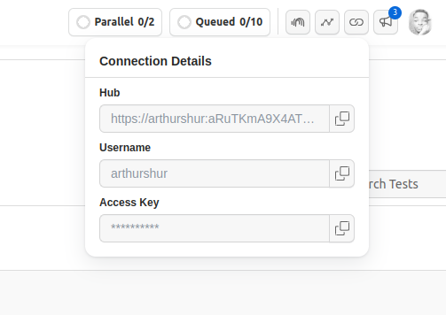
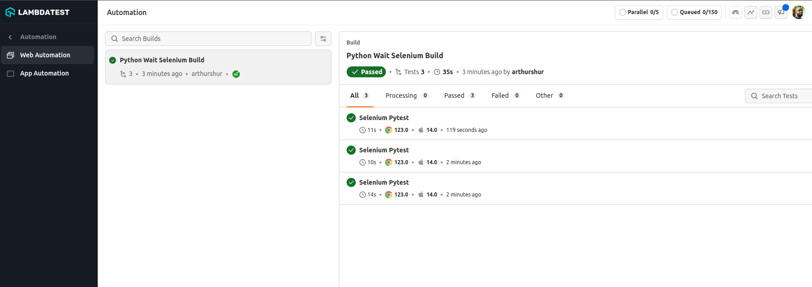

# Python Wait with Examples

This repo contains sample code to show how Python wait can be implemented  using Selenium on a chrome browser on a cloud testing platform.

Pytest is the browser automation framework used to execute the tests.


### Setup and Installation

Before you proceed, ensure that you have **Python3.x** and **pip** install on your computer.

**Step 1:** Clone this repository and navigate to the code directory as shown below:

```bash
git clone https://github.com/ginjardev/wait_in_python.git
cd wait_in_python
```


**Step 2:** Create a virtual environment in your project folder with the following command on the terminal.

```bash
python3 -m venv env
```


**Step 3:** Activate the environment.

```bash
source env/bin/activate
```


**Step 4:** Install the dependencies  from the cloned project directory:

```bash
pip install -r requirements.txt
```

### Authentication

**Step 5:** Set [LambdaTest](https://www.lambdatest.com/) **Username** and **Access Key** in environment variables.

In order to run your tests on LambdaTest cloud platform, you will need to set your [LambdaTest profile](https://accounts.lambdatest.com/dashboard) username and access key in the environment variables. Click the **Access Key** button at the top-right of the Automation Dashboard to access it.

See image below:

 

* **Linux/mac OS**

```bash
export LT_USERNAME="YOUR_USERNAME" 
export LT_ACCESS_KEY="YOUR ACCESS KEY"
```

* **Windows**

```bash
set LT_USERNAME="YOUR_USERNAME" 
set LT_ACCESS_KEY="YOUR ACCESS KEY"
```

### Executing The Test

**Step 6:** You would need to execute the below command in your terminal.

```bash
pytest -s
```

Your test results would be displayed on the console (or command-line interface if you are using terminal) and on LambdaTest automation dashboard.

### Run Parallel Tests

To run [parallel tests using PyTest](https://www.lambdatest.com/blog/pytest-tutorial-parallel-testing-with-selenium-grid/), we would have to execute the below command in the terminal:

```bash
pytest -n auto
```

### Results

View test results on LambdaTest web automation dashboard.

 